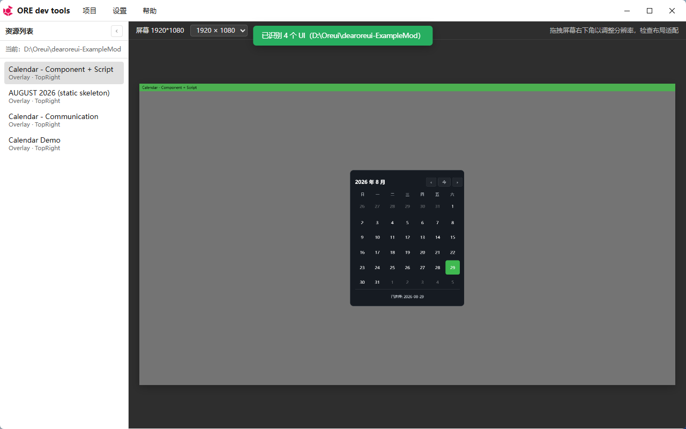

<div align="center">
  <h1>DearOreUI 设计器</h1>
  <p><strong>无需启动游戏，即可设计与预览 Minecraft Bedrock OreUI。</strong></p>
  <p>面向 <a href="https://github.com/copper-lamp/Dear-OreUI">DearOreUI</a> 运行时模组的离线可视化设计器（Tauri 2）。</p>

  <p>
    <a href="https://github.com/copper-lamp/DearOreUI-dev-tools/releases">下载</a>
    ·
    <a href="https://github.com/copper-lamp/Dear-OreUI">核心运行时</a>
    ·
    <a href="https://copper-lamp.github.io/dearoreui-docs/">项目文档</a>
    ·
    <a href="https://github.com/magicobs0z/dearoreui-ExampleMod">示例模组</a>
    ·
    <a href="README.md">English</a>
  </p>

  <p>
    <a href="https://github.com/copper-lamp/DearOreUI-dev-tools/releases"></a>
    <a href="https://github.com/copper-lamp/DearOreUI-dev-tools/releases"></a>
    <a href="https://github.com/copper-lamp/Dear-OreUI/blob/main/LICENSE"></a>
  </p>
</div>



## 这是什么？

DearOreUI 设计器让模组作者**无需运行 Minecraft 就能看到自己的 UI**。把它指向模组源码目录，它会静态扫描代码、还原模组声明的 OreUI 页面——**模组无需任何改动**——然后在近似 OreUI（Coherent Gameface）布局引擎的应用内画布上渲染。

| | |
| --- | --- |
| **目标用户** | [DearOreUI](https://github.com/copper-lamp/Dear-OreUI) 客户端模组作者 |
| **定位** | DearOreUI 运行时的离线预览与调试伴侣 |
| **工作流** | 打开模组目录 → 自动识别页面 → 点击预览 → 保存即刷新 |

## 核心能力

- **模组 UI 自动识别（源码扫描）。** 读取 C++ 源码中的 `registerComponent` 调用，还原 `DomNode` body 与 `ComponentSpec` 树。**模组无需任何改动。**
- **离线预览。** 无需游戏客户端即可在画布渲染识别到的 UI；基于 Yoga 的布局计算近似 OreUI 盒模型。
- **双加载模型。** 支持预览独立模组入口，以及「原版屏幕 + 模组覆盖层」组合。
- **侧边标签页。** 只展示模组实际改动/声明的页面，未改动的屏幕保持隐藏。
- **原版资源导入（计划中）。** 导入 `data/gui/dist/hbui` 素材，实现像素级 9-slice 贴图还原。

## 安装

从 [Releases](https://github.com/copper-lamp/DearOreUI-dev-tools/releases) 下载最新安装包，安装后启动桌面应用即可。

## 使用

1. 启动桌面应用。
2. **项目 → 打开模组目录**，选择目标模组源码目录（例如 `dearoreui-ExampleMod`）。
3. 左侧标签页列出自动识别出的 UI，点击即可在画布预览。
4. **项目 → 导入原版资源**，加载原版 UI 素材以贴近真机显示（计划中）。

## 技术栈

| 层 | 技术 |
| --- | --- |
| 桌面宿主 | Tauri 2 |
| UI | Vite + TypeScript |
| 渲染 | Yoga 布局计算近似 OreUI（Coherent Gameface）；复用运行时 `stage7` 脚本与 `{t,s,x,a,c}` 节点格式 |
| 扫描 | `src-tauri/src/mod_scanner.rs` —— 静态、只读的 C++ 源码分析 |

## 开发

```powershell
npm install        # 安装依赖
npm run tauri dev  # 以开发模式启动桌面应用
```

Rust 扫描器位于 `src-tauri/src/`，渲染前端位于 `src/`。使用 `npm run tauri build` 构建发行版（见 `.github/workflows/release.yml`）。

## 生态

这是 DearOreUI 工具链的一部分：

| 项目 | 仓库 | 作用 |
| --- | --- | --- |
| **DearOreUI** | [copper-lamp/Dear-OreUI](https://github.com/copper-lamp/Dear-OreUI) | 原生 LeviLamina 运行时 —— 在运行时扩展 OreUI |
| **DearOreUI 设计器** | [copper-lamp/DearOreUI-dev-tools](https://github.com/copper-lamp/DearOreUI-dev-tools) | 本仓库 —— 离线可视化预览 |
| **DearOreUI 文档** | [copper-lamp/dearoreui-docs](https://github.com/copper-lamp/dearoreui-docs) | 官方文档与学习站点 |
| **dearoreui-ExampleMod** | [magicobs0z/dearoreui-ExampleMod](https://github.com/magicobs0z/dearoreui-ExampleMod) | 阶梯教程模组 |
| **dearoreui-repo** | [copper-lamp/dearoreui-repo](https://github.com/copper-lamp/dearoreui-repo) | 自托管 xmake 包仓库 |

## 许可证

[CC0-1.0](https://github.com/copper-lamp/Dear-OreUI/blob/main/LICENSE)，与 DearOreUI 运行时保持一致。